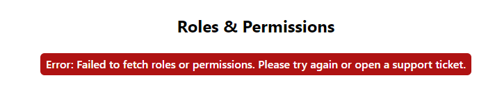
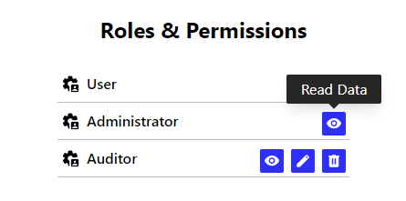
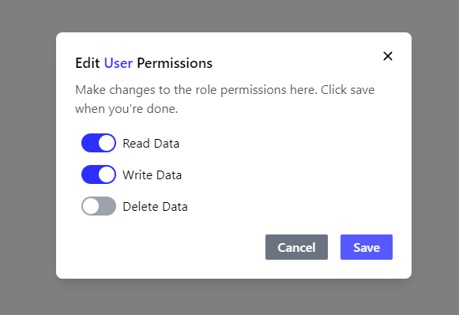
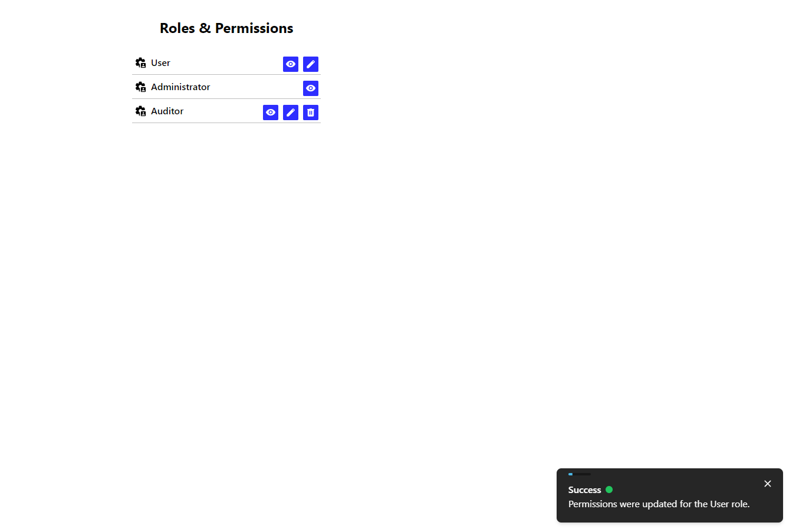

# Role Dashboard

## Setting up the project

I used [pnpm](https://pnpm.io/) since it is more efficient than npm. You can install it with npm: `npm install -g pnpm`.


Install the project dependencies with `pnpm install` and start the development server:

```bash
pnpm run dev
```

## Building

To create a production version of your app:

```bash
pnpm run build
```

You can preview the production build with `pnpm run preview`.

## Used Libraries

I used [Svelte](https://svelte.dev/) + [SvelteKit](https://kit.svelte.dev/) for development. Components were built with [melt-ui](https://melt-ui.com/) to ensure high-quality accessible behaviour that follows WAI-ARIA guidelines. For the styling I used [UnoCSS](https://github.com/unocss/unocss) with the [Wind preset](https://unocss.dev/presets/wind), which allows us to use TailwindCSS and WindiCSS atomic CSS classes. Additionally we can implement icons as simple CSS classes with the [icon preset](https://unocss.dev/presets/icons). 

## Project Structure

- Components can be found inside `src/lib/`.
- The UI code is inside `src/routes/+page.svelte`.
- The theme is defined with `src/routes/app.css` and `uno.config.ts`.

## Screenshots

An error message gets displayed when an error occurs while trying to fetch permissions and roles:





A tooltip appears when hovering a permission icon:





A dialog opens when editing role permissions. The role is referenced in the title and each of the permissions can be turned on or off using switches:





A toast message appears, giving feedback when permissions have been adjusted for a role:





## Problem Statement

The given system uses a permission-based access control system. Each user has a role containing a subset (0...n) of the available permissions.

To configure the roles, a user interface with the following requirements should be developed:
- As a user, I want to see the available roles together with their permissions.
- As a user, I want to be able to change the permissions of a role.

### Task

Design and develop a (web) user interface that implements (at least) the given requirements in production-ready quality.
- Use the provided mocked service.
- Use technologies, frameworks, component libraries, etc. of your choice.
- The language shall be TypeScript.
- Extensions are welcome but not necessary.
